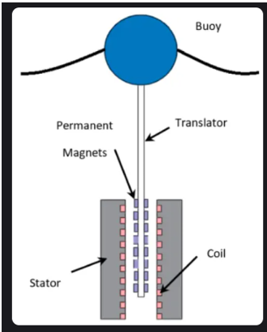
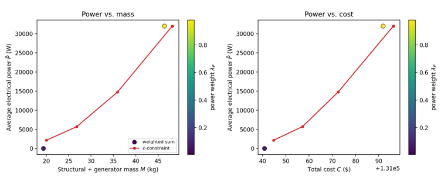

# OptiForge-MAE-598

MAE 598 Team Project repository for OptiForge
<p align="center">
  
</p>

<h1 align="center">🌊 Sea-Wave Energy Converter Optimization</h1>

<p align="center">
<b>Multi-Objective Optimization of a Direct-Drive Wave Energy Converter Using a Linear Permanent-Magnet Generator</b>
</p>

<p align="center">


</p>

---

# 📖 Overview

Ocean waves are a promising source of renewable energy. This project presents a **multi-objective optimization framework** for designing a **direct-drive Wave Energy Converter (WEC)** that uses a **Linear Permanent-Magnet Generator (LPMG)** to convert the vertical motion of ocean waves into electrical power.

The optimization simultaneously aims to:

- ⚡ Maximize electrical power generation
- ⚖️ Minimize structural mass
- 💰 Minimize total manufacturing cost
- ✅ Satisfy mechanical, electrical, thermal, magnetic, and geometric constraints

This project was completed for **MAE 598 – Optimization** in the **Department of Mechanical Engineering** at **Arizona State University**.

---

# 👥 Team Members

- Wei Lu
- Kouassi Ngoran Abel
- YenChun Pan
- Romeo Anderson Konadu
- Aaldin Kesavan Helen

**Instructor:** Dr. Ren Yi

---

# 🌊 Device Architecture

<p align="center">

</p>

The proposed system consists of a floating cylindrical buoy mechanically coupled to a direct-drive linear permanent-magnet generator. As ocean waves move the buoy vertically, permanent magnets attached to the translator move through stationary coils, producing electricity through electromagnetic induction.

---

# 🎯 Project Objectives

The optimization simultaneously considers three competing objectives:

- Maximize electrical power output
- Minimize structural mass
- Minimize total system cost

Because these objectives conflict with one another, the problem is formulated as a **multi-objective nonlinear optimization problem**.

---

# 📐 Design Variables

| Variable | Description |
|----------|-------------|
| **Rb** | Buoy radius |
| **ts** | Hull shell thickness |
| **Hb** | Buoy height |
| **N** | Number of generator coil turns |
| **B** | Magnetic flux density |
| **g** | Magnet-to-coil air gap |
| **RL** | External load resistance |

---

# 📋 Engineering Constraints

The optimization satisfies several engineering constraints:

- Mechanical stress limits
- Electrical voltage limits
- Current limits
- Thermal limits
- Magnetic saturation
- Mass constraints
- Cost constraints
- Geometric limits

---

# ⚙️ Optimization Methodology

The project compares two multi-objective optimization techniques.

## Weighted-Sum Optimization

- Sequential Least Squares Programming (SLSQP)
- Multi-objective weighted formulation
- Pareto-front exploration

## ε-Constraint Optimization

- Maximizes electrical power
- Uses structural mass as a constraint
- Identifies Pareto-optimal solutions that cannot be reached using weighted-sum optimization alone

---

# 🛠 Software & Tools

- Python
- NumPy
- SciPy
- Matplotlib
- MATLAB

---

# 📊 Results

<p align="center">

</p>

## Key Findings

- Maximum average electrical power of approximately **32 kW**
- Weighted-sum optimization converges to two dominant design solutions.
- ε-constraint optimization identifies additional Pareto-optimal solutions.
- Electrical generator ratings become the primary limiting factor before structural constraints.
- The optimization demonstrates the trade-off between electrical power, structural mass, and total system cost.

---

# 📁 Repository Structure

```text
Sea-Wave-Energy-Converter-Optimization/
│
├── README.md
├── report.pdf
├── LICENSE
├── requirements.txt
│
├── images/
│   ├── device_schematic.png
│   └── results.png
│
├── src/
│   ├── wec_model.py
│   └── solve_pareto.py
│
├── figures/
└── data/
```

---

# 📄 Project Report

The complete technical report is available below.

📄 **[Download the Full Project Report (PDF)](Opt__Report.pdf)**

The report includes:

- Mathematical formulation
- Engineering assumptions
- Wave energy converter modeling
- Optimization methodology
- Numerical implementation
- Simulation results
- Sensitivity analysis
- Conclusions
- References

---

# 🚀 Future Work

Potential improvements include:

- Boundary-element hydrodynamic simulations
- Finite-element electromagnetic analysis
- Mixed-integer nonlinear optimization
- Alternative buoy geometries
- Experimental prototype construction
- Wave-tank testing
- Offshore deployment studies

---

# 📚 References

- Falnes, J. *Ocean Waves and Oscillating Systems: Linear Interactions Including Wave-Energy Extraction.* Cambridge University Press, 2002.
- Leijon, M., et al. *Wave Energy from the North Sea: Experiences from the Lysekil Research Site.* Surveys in Geophysics, 2008.
- Nocedal, J., & Wright, S. *Numerical Optimization (2nd Edition).* Springer, 2006.

---

# 📜 License

This project was developed for educational and research purposes as part of **MAE 598 – Optimization** at **Arizona State University**.

If you use or build upon this work, please cite the project appropriately.
